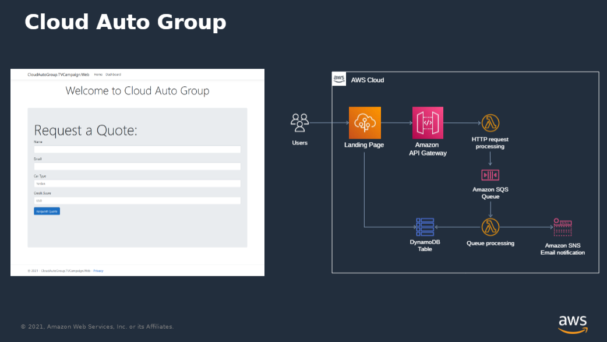

The CloudAutoGroup TVCampaign project built during my [.NET Enterprise Developer Day](https://www.developerweek.com/global/conference/cloud/net-enterprise-developer-day-hosted-by-amazon-web-services/) talk: _Infrastructre as Code in C# using AWS CDK_

## Recording

The session recording is **Coming Soon**

## Background

The CloudAutoGroup is launched a TV Campaign inviting users to come to their website to request a quote for car insurance.

This repository contains that application as well as the AWS CDK code necessary to fully deploy it.

## Deploying

1. Modify `CloudAutoGroup\Cdk\Program.cs` to specify your AWS Account Id and optionally change the region.
1. Make sure your local environment is setup to run AWS CDK.  
	1. Basically, Npm installed, Cdk installed, Docker installed and running.
	1. This video walks through setup: **https://www.youtube.com/watch?v=5aBf0W0_FDY**

From the root of the solution, run:

```
cd CloudAutoGroup
cdk deploy
```
## Solution Organization

- Web - ASP.NET Core MVC Web app.  Hosts the Landing Page where customers can request a quote and the Dashboard Page where admins can see all quotes
- RequestQuoteApi - Web front end calls this Lambda Function to start the processes of generating a Quote.  Performs basic business validation and then puts the Quote Request on the queue to be picked up the RequestQuoteProcesor.
- RequestQuoteProcessor - Lambda function invoked whenever a new message is placed on the queue by the RequestQuoteApi.  Processes the Quote, calculates a Monthly Premium and stores the Full Quote in a dynamodb table so the front end Dashboard can display the results.
- Shared - Contains domain models, a repostiory, and a queue client.
- Cdk - This is what the talk focuses on.  This contains all of the code necessary to fully deploy the solution.  It demonsrates how we to wire up configuration so the Web front-end can know the RequestQuoteApi Url and the RequestQuoteProcessor knows which queue to listen to.  Also shows how to easily setup IAM Permissions so both the RequestQuoteProcessor and Web can talk to the dynamodb instance.


## Developing the Solution

Explore the git history to see each step that was involved in building this application.

You can see some additional context in the `script.pptx` PowerPoint presentation.